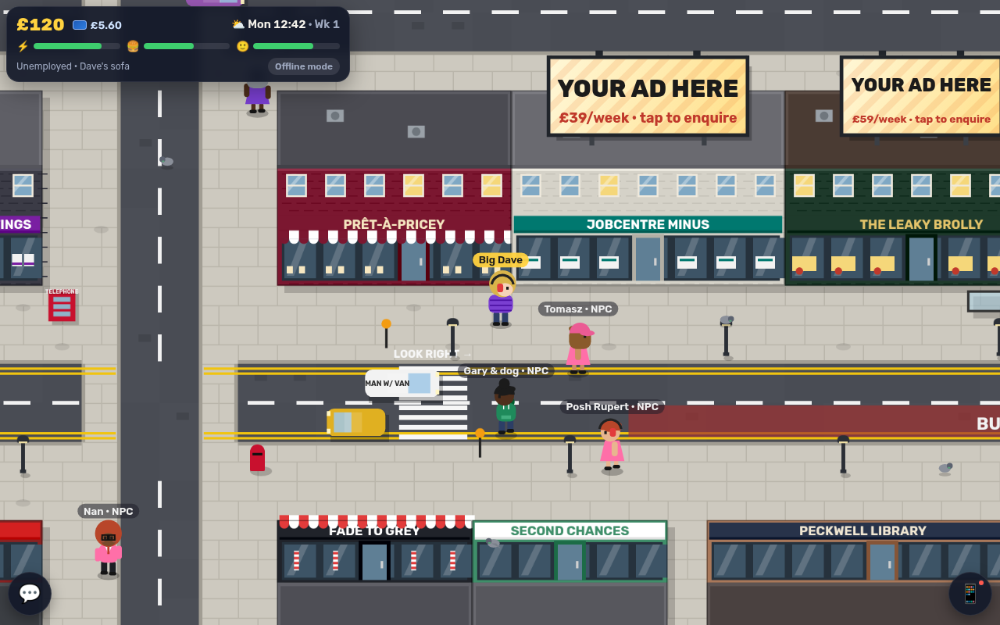
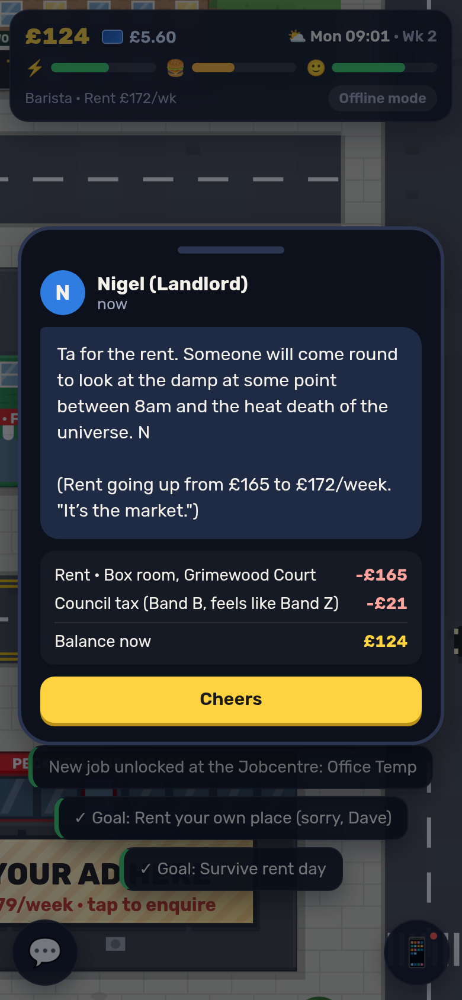
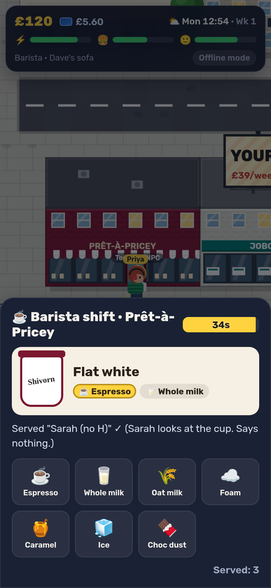

# UK Life · Peckwell, London

A cheeky, free, browser-based life sim set on one fictional London high street. Make a character, sleep on your mate Dave's sofa, get a job at **Jobcentre Minus**, earn a few quid, eat a sausage roll from **Crumbs & Co.**, rent a box room off Nigel, and try to survive **rent day** (every Monday, 09:00). It rains. Obviously.

Working title, prototype stage. Inspired by the *idea* of Lagos Life (a social life-sim in your own city, part-funded by in-game billboards), but done the British way: Tube, Oyster, Greggs-style bakery, corner shop, chicken shop, Pret-style café, council tax, landlords and drizzle. All brands are parodies, and all art is drawn in code. There are no third-party assets except two OFL fonts.

<p>
  
  
  
</p>

**Stack:** React 19 + Vite + TypeScript, Canvas 2D renderer, optional Supabase Realtime for multiplayer. It's a static site, so it hosts on Vercel with no server.

---

## What's in the prototype

| | |
|---|---|
| **Character creation** | Name, skin tone, 7 hairstyles, hair colour, 6 outfits (hoodie, puffer, trackie, suit, dress, hi-vis), colour, extras (cap, beanie, specs, headphones). Change your look later at Fade to Grey Barbers for £12. |
| **Map** | Peckwell: a 60×44-tile neighbourhood with a high street, a residential road, a cross street, an Overground line and a park (pond, bandstand, a trolley in the pond). Two Tube stations and an Overground station. Traffic drives on the **left**, a slow 436 bus holds everyone up, cars stop at zebra crossings, pigeons scatter, trains rattle past, street lamps come on at night and it rains now and then. |
| **Places** | Peckwell Broadway & Peckwell Common (Tube), Albion Road (Overground), Crumbs & Co. (bakery), Kwik Mart Food & Wine (corner shop), Prêt-à-Pricey (café), PFC Peckwell Fried Chicken, The Leaky Brolly (pub), Jobcentre Minus, Fleecems Lettings, Fade to Grey Barbers, Spin City Launderette, Second Chances charity shop, Peckwell Library, LadBroke Bookmakers, PureGrind 24/7 Gym, Pawnderful, Synergy House (office), Peckwell Bus Garage, Inkerman Terrace, plus three places to live, and four outdoor spots with floating markers: the duck pond, the bandstand, the allotments and the 436 bus stop. |
| **Timed actions** | Every door has a menu of things to do, each taking 4–40 real seconds with a progress bar, a cost, effects and a cheeky result line: buy a round, enter the Tuesday pub quiz (£50 prize), pat Clive the pub dog, use the library's free Wi-Fi (opening hours apply), feed the ducks (peas, not bread), help Nan with her marrows, do a service wash, sit next to the tumble dryers, ask Crumbs if there's any warm ones, lose £2 on a horse called *Nigel's Deposit*, wait for the 436, busk in the ticket hall… about 100 in total. |
| **Needs & moodlets** | Five needs (⚡ energy, 🍔 fullness, 💬 social, 🫧 hygiene, 🧣 warm & dry) feed your 🙂 mood, and mood scales your pay. Moodlets like *Had a Crumbs* (+8), *Soaked* (−10), *Hangry*, *Whiffy*, *Quiz Champions* or *Swanned* (a swan chased you) nudge mood for a while. Tap the HUD to see them. |
| **Real UK time** | Peckwell runs on the real Europe/London clock: lamps come on at real dusk, the pub quiz is on real Tuesday nights, and rent leaves your account at the real **Monday 09:00**. While you're out and about your personal "life clock" runs 4× faster so needs actually move. Come back after a break and a capped (12h), gentle catch-up tells you what happened while you were out. Daily login streak with a small reward each day. |
| **Economy loop** | Needs drain over time; places restore them for £. You work shifts to earn money. Rent and council tax leave your account every Monday at 09:00, with a landlord WhatsApp (and a surprise rent rise about 45% of the time, "because of The Market"). Miss a payment and you're in arrears; miss two and you're evicted back to Dave's sofa. Oyster balance pays for fast travel between stations (£2.80). A brolly stops rain hurting your mood, until you lose it (3 days, guaranteed). The park lifts your mood. Run out of energy and you pass out on the night bus. |
| **Jobs** (each takes in-game hours) | **Barista** at Prêt-à-Pricey: build drinks in the right order against the clock. **Delivery Rider** at PFC: an on-map shift where you ride to 3 doors with a timer, and quicker drops earn bigger tips. **Office Temp** at Synergy House (unlocks after 1 shift): inbox triage, i.e. reply to the boss, archive the yoghurt thread, report the phishing. **Bus Driver** at the Bus Garage (unlocks after 3 shifts): stop the 436 at the stop. |
| **Homes** | Dave's sofa (free) → box room in a flatshare (£165/wk) → studio (£295/wk) → one-bed with a concierge (£520/wk). Move in costs a week's rent plus a deposit. Sleep, nap, shower, beans on toast or put the kettle on (teabags required) at home. |
| **Your phone** (📱) | **Natter**, the local social feed: post, like and reply, while the NPC locals moan about the 436, gossip about what you’ve just done (“{you} at the pond feeding the ducks. Gerald the duck looked so happy.”), reply to your posts, and Big Tel says he can't complain (then complains in a reply thread). **Messages**: one-to-one DMs with locals (typing indicator, occasionally left on read), Mum, Dave, and other real players; landlords and the bank text you here too. Plus Work, Bank (rent countdown), Goals (12), Me (needs, moodlets, skills, stats) and Settings (mute list, allow DMs, help). |
| **Billboards** | 6 ad slots on the map (rooftops, the railway bridge, the park gate) showing "YOUR AD HERE · £X/week". Tap one for price, estimated footfall and a mock enquiry. No payments are taken and nothing is sent. |
| **Multiplayer** | See other players walking around in real time with name tags and speech bubbles. Players' Natter posts appear in everyone's feed and as speech bubbles; DMs go only to the addressed player (they're relayed, **not end-to-end encrypted**, and the UI says so). Posts are limited to 140 characters (1 per 8s), DMs to 200, and everything goes through a profanity filter. Mute and report are on every post and thread. The filter allows mild British banter ("bloody", "git", "muppet"), masks strong swearing including leetspeak, removes slurs, and is re-applied on receive. There's a live player counter in the HUD. |
| **Persistence** | Your progress saves to `localStorage` every few seconds and when the tab is hidden. |
| **Controls** | Tap or click to walk there (hold to keep walking). Tap a building to walk to its door and go in. WASD or arrow keys also work. `E`/`Enter` goes in, `T` opens Natter, `P` opens the phone, `Esc` closes things. |

### Single-player vs multiplayer

- **No env vars (default, e.g. local dev or a fresh Vercel deploy):** the HUD shows **Offline mode**. Peckwell is populated by 8 NPC locals (tagged `NPC`) who wander between shops and post on Natter. Other tabs in **the same browser** also show up as real players over `BroadcastChannel`, which is handy for testing.
- **With `VITE_SUPABASE_URL` + `VITE_SUPABASE_ANON_KEY`:** everyone joins one Supabase Realtime channel (`uklife:peckwell`). **Presence** handles who's online and the player count. **Broadcast** carries positions (about 5 messages/s while moving, plus a heartbeat every 2.5s), Natter posts, likes and DMs. 4 NPCs still wander around locally so the street never feels dead. They're clearly tagged and their posts only appear on your own screen.
- Your money, job, home and stats are always local to your device. Nothing economic is shared or server-authoritative yet (see caveats).

---

## Run it locally

```bash
npm install
npm run dev          # http://localhost:5173
```

Other scripts:

```bash
npm run typecheck    # tsc --noEmit
npm test             # vitest: London clock + rent key, billing, catch-up, streaks, save migration, needs/moodlets, timed actions, social store + NPC brain, filter, wire sanitising, map, two-client transport
npm run build        # typecheck + production build to dist/
npm run preview      # serve dist/ on http://localhost:4173

# headless screenshot tour + two-tab multiplayer check (needs a Chrome; set CHROME=/path/to/chrome)
npm run preview &    # in another terminal
npm run shots        # writes ./shots/*.png
npm run test:mp
```

Add `?debug=1` to the URL to expose `window.__ukl` (the engine) in the console, e.g. `__ukl.engine.setRain(true)` or `__ukl.setClockOffset(__ukl.msUntilRent() - 5000)` (five seconds before rent day). `?debug=1&clock=<ms>` starts the whole game shifted in time.

To enable multiplayer locally, copy `.env.example` to `.env.local` and fill it in.

---

## Deploy on Vercel

1. Go to **vercel.com → Add New… → Project → Import** `Philoso4er/uk-life`.
2. Framework preset: **Vite** (detected automatically; `vercel.json` pins `npm run build` → `dist`).
3. Click **Deploy**. That's it: the game runs in offline mode with NPCs.

### Turn on real multiplayer (optional, free tier is fine for a prototype)

1. Create a project at [supabase.com](https://supabase.com) (free plan).
2. **Project Settings → API**: copy the **Project URL** and the **anon / publishable** public key.
3. In Vercel: **Project → Settings → Environment Variables**, add:
   - `VITE_SUPABASE_URL` = `https://<your-ref>.supabase.co`
   - `VITE_SUPABASE_ANON_KEY` = `<anon public key>`
4. **Redeploy.** `VITE_` vars are baked in at build time, so a redeploy is required.

**Supabase setup you need: nothing else.** Realtime is on by default, and Broadcast and Presence don't use any database tables, migrations or RLS policies. The one setting to check is **Realtime → Settings → "Allow public access"**, which must stay **Enabled** (that's the default). If you switch it off, the project only allows private channels, and you'd have to add Realtime Authorization (RLS on `realtime.messages`) and `config: { private: true }` in `src/net/supabase.ts`.

The anon key is public by design, so it's fine to ship in a static bundle. Because the channel is public, anyone with the key could post to it. That's why every incoming message is validated and re-filtered on each client (`src/net/types.ts`).

---

## Project layout

```
src/
  game/
    world.ts      map, buildings, billboards, stations (tile grid + metadata)
    render.ts     pre-rendered static world + dynamic drawing (vehicles, billboards, pigeons, train)
    avatar.ts     procedural character drawing + options
    engine.ts     game loop, input, camera, collisions, NPCs, ambient life, net sync, snapshot store
    time.ts       real Europe/London clock, rent key (Monday 09:00), debug clock offset
    needs.ts      needs, moodlets, mood, passing time
    actions.ts    every place's timed actions (costs, effects, outcomes)
    economy.ts    jobs + career ladders, homes, rent/council tax, streaks, catch-up, save/load + migration
    social.ts     Natter feed + Messages store (posts, likes, replies, DMs, mute/report)
    npcs.ts       NPC personas, their posts, gossip, replies and DMs
    pathfind.ts   A* + path smoothing for tap-to-move
    bots.ts       NPC walkers
  net/
    supabase.ts   Supabase Realtime transport (presence + broadcast)
    local.ts      BroadcastChannel transport (offline mode / tests)
    filter.ts     profanity filter + length limits
    types.ts      wire types + sanitising
  ui/             React screens: title, creator, HUD, place menus, phone, event cards, mini-games
scripts/          Playwright screenshot tour + two-tab multiplayer check
```

---

## Roadmap

- **More boroughs:** a second neighbourhood per line (Shoreditch-ish, Brixton-ish, Croydon-ish), with the Tube map as the world map and zone-based fares.
- **Travel further:** a mainline station with trains to Manchester, Birmingham, Edinburgh and Cardiff, a Heathrow-ish airport for "going on holiday" events, plus a night bus and Santander-ish hire bikes.
- **Paid billboards:** a self-serve booking flow with Stripe Checkout, uploaded creative with moderation, impression counts from real player footfall, and a scheduling calendar.
- **Housing upgrades:** furnish your flat, flatmates (other players), house parties, buy-to-let as a late-game grind, and Right to Buy jokes.
- **Server-side economy:** move money and rent to Supabase (Postgres + RLS + edge functions) so progress follows you across devices and can't be faked. Add accounts via magic link.
- **Social:** emotes (the British nod), group chats, shared likes/history via a database, five-a-side as a real multiplayer event.
- **Seasonal events:** Notting Hill-ish carnival, Bonfire Night, a heatwave (24°C, a national emergency), a Boxing Day sale queue.
- **Moderation:** report/mute, server-side filtering, and rate limits enforced by an edge function.
- **Sound:** rain ambience, Tube chimes, "mind the gap".

## Honest caveats

- Multiplayer is **positions + Natter posts/likes/DMs only**. Feed history and like counts are per-device (they aren't stored on a server), and NPC posts are local to each player. The economy is client-side, so it's easy to cheat in your own save, which is fine for a prototype.
- The Supabase transport has been type-checked against `@supabase/supabase-js` v2 but **not tested against a live project** (no credentials were available while building this). The same code paths (remote players, interpolation, chat, counter) were tested end-to-end with the BroadcastChannel transport in two headless tabs, plus unit tests.
- On Supabase's free tier, the realtime **message quota** will be the first thing you hit if it gets busy: every position update is fanned out to every connected player. Check the current plan limits. Before going big, add area-based channels, lower the tick rate or move to a dedicated game server.
- The profanity filter is a word list. It's decent but beatable.
- Time is real: rent day is once a real week. Your needs run on a faster personal "life clock" while you play, so the two don't line up exactly (by design).
- Parody names are deliberately not real trademarks, and the station mark is our own diamond, not the TfL roundel. It's still worth a sanity check before any commercial launch.

## Credits

Fonts: [Rubik](https://github.com/googlefonts/rubik) and [Pixelify Sans](https://github.com/eifetx/Pixelify-Sans), both SIL Open Font License 1.1 (see `public/fonts/OFL.txt`). Everything else (map, characters, vehicles, UI) is drawn in code.
